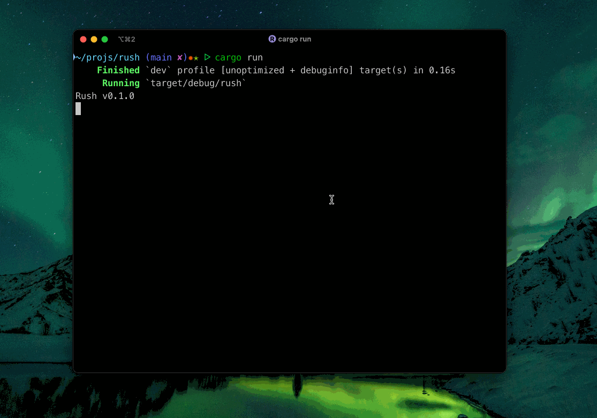

# Rush

A "beagleful" shell written in Rust. It is both blazingly fast and lightweight, and easy to learn.

Our goal is to have a shell that it's fast, lightweight and easy to learn and cross-platform. Also have a Bourne shell-compatible shell not only for macOS or Linux but for Windows, too.

"We won't publish our Bourne shell-compatible shell for Windows because Windows is terrible, is not free and open-source, it's bloated, Just for Linux" no more.

> [!CAUTION]
>
> The project is under development. It may crash and it doesn't advanced features

> [!NOTE]
>
> Rush is not Bourne shell-compatible shell, yet.



## Installation

### Using Cargo

```shell
cargo install rush
```

### Package managers

Not avaliable yet.

## More about it

